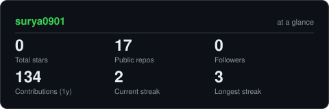
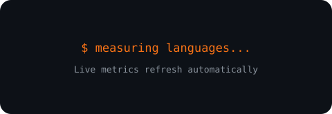
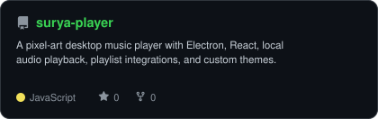
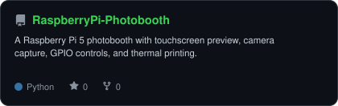
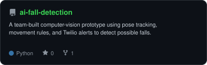
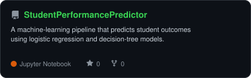

<div align="center">

<!-- PORTRAIT -->


<br>

<!-- NAME / TAGLINE -->
<a href="https://github.com/surya0901">
  
</a>

<br>

<!-- SOCIALS -->
<a href="https://www.linkedin.com/in/surya-gopinath/"></a>
<a href="mailto:Suryagopinath01@gmail.com"></a>
<a href="https://suryagopinath.com"></a>
<a href="https://medium.com/@suryagopinath01"></a>

<br>


</div>

---

## `~/` whoami

```console
$ cat about.txt
```

Hi, I'm **Surya Gopinath**. I build things across software, cloud, AI, and hardware,
usually where an ambitious idea needs both engineering depth and a practical path into the real world.

- Co-Founder & Software Engineer at **GeoZane**, building AI-powered land-feasibility tools
- M.S. Computer Engineering student at **Rutgers University**
- Winner at **[HackPrinceton Spring 2026](https://devpost.com/software/terra-zone)** with Terra-Zone AI
- Currently building **[Surya Player](https://github.com/surya0901/surya-player)** and Raspberry Pi hardware projects
- Fun fact: **I started in biomedical engineering and now build technology across disciplines.**

<br>

<div align="center">

## `~/` toolbox


</div>

---

<div align="center">

## `~/` skill radar

<table>
<tr>
<td width="50%" align="center" valign="middle">

<!-- Self-rated radar -->
<picture>
  <source media="(prefers-color-scheme: dark)" srcset="assets/radar-dark.svg">
  <source media="(prefers-color-scheme: light)" srcset="assets/radar-light.svg">
  
</picture>

</td>
<td width="50%" align="center" valign="middle">

<!-- Live language radar -->
<picture>
  <source media="(prefers-color-scheme: dark)" srcset="assets/radar-langs-dark.svg">
  <source media="(prefers-color-scheme: light)" srcset="assets/radar-langs-light.svg">
  
</picture>

</td>
</tr>
</table>

</div>

---

<div align="center">

## `~/` contribution calendar

<!-- Generated by the Metrics workflow -->


<br><br>

<!-- Generated by the Snake workflow -->
<picture>
  <source media="(prefers-color-scheme: dark)" srcset="https://raw.githubusercontent.com/surya0901/surya0901/output/snake-dark.svg">
  <source media="(prefers-color-scheme: light)" srcset="https://raw.githubusercontent.com/surya0901/surya0901/output/snake.svg">
  
</picture>

</div>

---

<div align="center">

## `~/` the numbers

<picture>
  <source media="(prefers-color-scheme: dark)" srcset="assets/card-stats-dark.svg">
  <source media="(prefers-color-scheme: light)" srcset="assets/card-stats-light.svg">
  
</picture>

<br>



<br><br>


</div>

---

<div align="center">

## `~/` selected work

<table>
<tr>
<td width="50%" align="center">
  <a href="https://github.com/surya0901/surya-player">
    <picture>
      <source media="(prefers-color-scheme: dark)" srcset="assets/card-surya-player-dark.svg">
      <source media="(prefers-color-scheme: light)" srcset="assets/card-surya-player-light.svg">
      
    </picture>
  </a>
</td>
<td width="50%" align="center">
  <a href="https://github.com/surya0901/RaspberryPi-Photobooth">
    <picture>
      <source media="(prefers-color-scheme: dark)" srcset="assets/card-RaspberryPi-Photobooth-dark.svg">
      <source media="(prefers-color-scheme: light)" srcset="assets/card-RaspberryPi-Photobooth-light.svg">
      
    </picture>
  </a>
</td>
</tr>
<tr>
<td width="50%" align="center">
  <a href="https://github.com/surya0901/ai-fall-detection">
    <picture>
      <source media="(prefers-color-scheme: dark)" srcset="assets/card-ai-fall-detection-dark.svg">
      <source media="(prefers-color-scheme: light)" srcset="assets/card-ai-fall-detection-light.svg">
      
    </picture>
  </a>
</td>
<td width="50%" align="center">
  <a href="https://github.com/surya0901/StudentPerformancePredictor">
    <picture>
      <source media="(prefers-color-scheme: dark)" srcset="assets/card-StudentPerformancePredictor-dark.svg">
      <source media="(prefers-color-scheme: light)" srcset="assets/card-StudentPerformancePredictor-light.svg">
      
    </picture>
  </a>
</td>
</tr>
</table>

<sub>

| project | live | stack |
|---|---|---|
| **[Terra-Zone AI](https://devpost.com/software/terra-zone)** | [Devpost](https://devpost.com/software/terra-zone) | `React` `TypeScript` `Supabase` `Gemini` |
| **[Surya Player](https://github.com/surya0901/surya-player)** | [GitHub](https://github.com/surya0901/surya-player) | `Electron` `React` `JavaScript` `OAuth` |
| **[Raspberry Pi Photobooth](https://github.com/surya0901/RaspberryPi-Photobooth)** | [Portfolio](https://suryagopinath.com/#hardware) | `Python` `Raspberry Pi` `Picamera2` `GPIO` |
| **[Developer Portfolio](https://suryagopinath.com)** | [suryagopinath.com](https://suryagopinath.com) | `Web` `Interactive Design` `Project Logs` |

</sub>

</div>

---

<div align="center">

<sub>`01110100 01101000 01100001 01101110 01101011 01110011 00100000 01100110 01101111 01110010 00100000 01110011 01100011 01110010 01101111 01101100 01101100 01101001 01101110 01100111`</sub>

</div>
